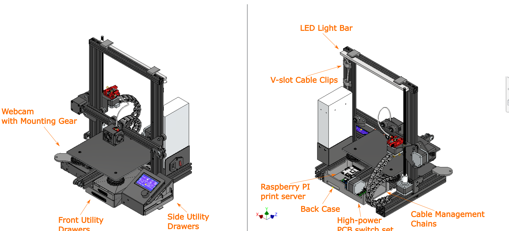
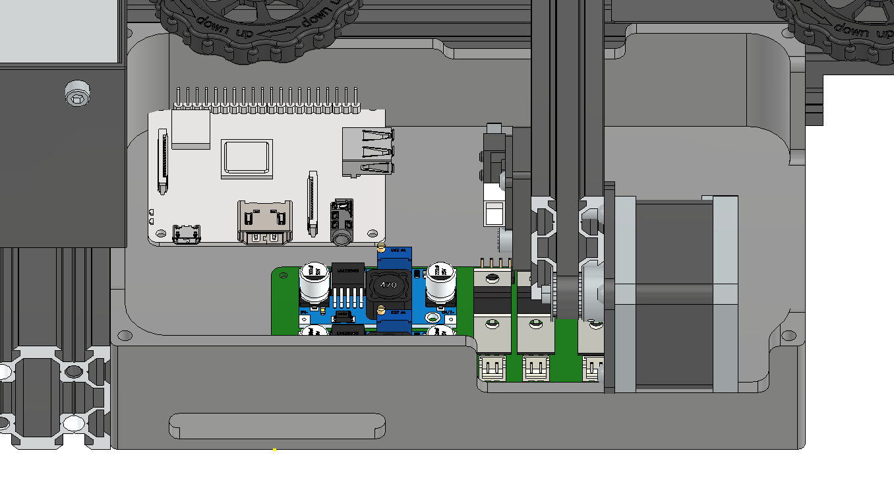
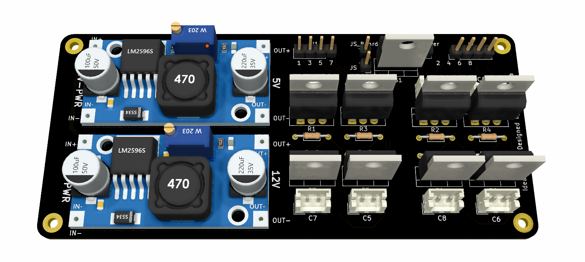
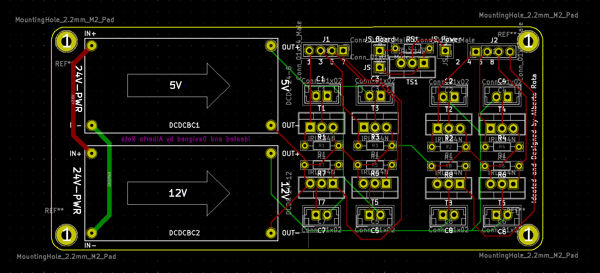
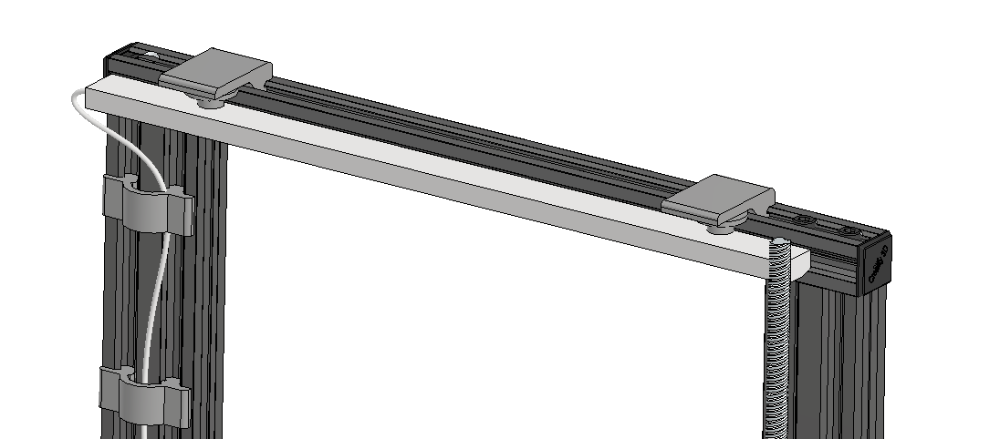
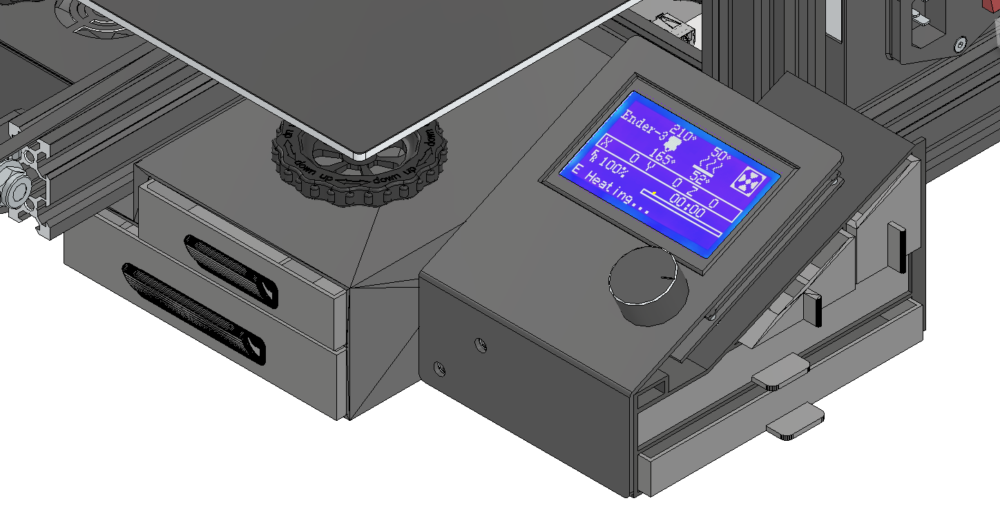
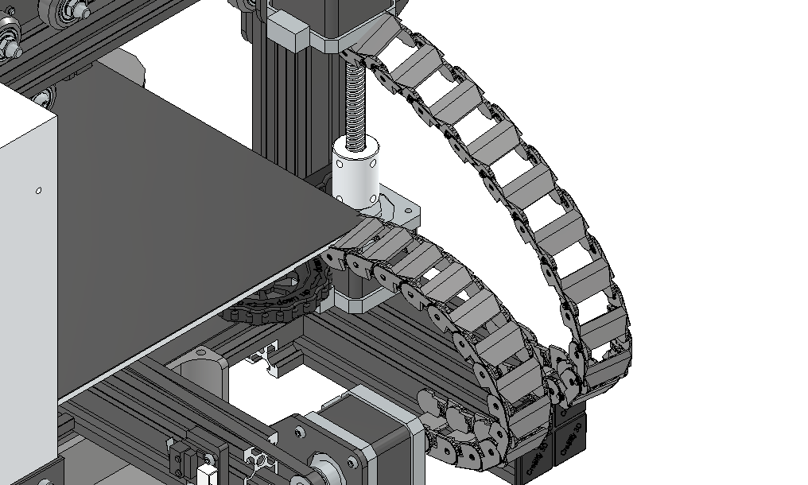
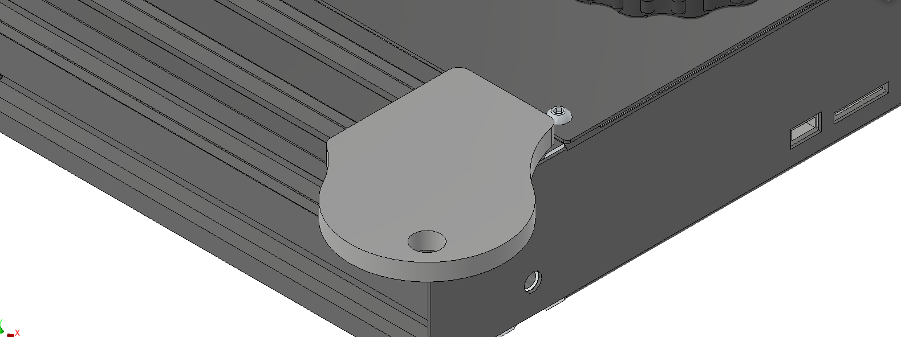

# Ender3-Upgrade
A collection of upgrades and mods I installed on my Creality Ender 3.

This repository includes:
- A CAD model of the 3D printer, that includes the modifications made to the original design
- Downloadable `stl` files for the 3D printed parts
- The Marlin 2.0 firmware installed
- The PCB design for the custom electronic boards
  
***

 
<a href="https://minhaskamal.github.io/DownGit/#/home?url=https://github.com/alberto-rota/Ender3-Upgrade/Printables">
<picture>
  <source media="(prefers-color-scheme: dark)" srcset="readme/download_stls_light.png">
   
</picture>
</a> 

All parts have been printed in standard 1.75 PLA filament, with a 4mm nozzle. They can be printer on any 3D printer, from hobbyist to professional. Print settings change depending on the part and the printer, but as long as a good bed adhesion is achieved, all parts will come out fine. The only part that requires a bit of support material in some place is the "Back case".

***
## Overview
The full Ender3 printer complete with all the upgrades is depicted below:

***
### Print Server
A Raspberry Pi 3A+ is used to host an OctoPrint server to remotely control and monitor the 3D printer. The Pi is powered from its separate power supply, connected to the printer via a USB cable, connected to the local network via WiFi (this was a limitation due to the available 3A+ model, a different model will be connected via Ethernet) and to an external USB webcam via a USB cable. A OTG USB hub (not in the picture) is necessary if using a 3A+

**NOTE:** This project was carried out during the COVID-19 pandemic, with the limited availability of electronics component (Pis cost more than 200€).

In order to control "high-power" components from Octoprint (USB lights, custom Noctua Fans), a custom PCB mounting a set of MOSFET switches was custom designed and integrated in the printer. The PCB mounts 2 Buck converters to step down the 24V of the Power supply to 5V (for the USB lights) and 12V (for the Noctua fans) and is connected to the Raspberry via the GPIO pins.

The render and the schematics of the PCS are shown below:

The Pi, PCB, hub and cables are all positioned into a custom 3D printed case, that is mounted in the V-slots of the aluminum extruded profiles.

***
### USB light bar

A USB LED strip is mounted on the top horizontal frame of the printer, to provide a light source for the print bed. Two supports were necessary in order to hold the magnets that came with the LED bar and that hold it in place. The supports and custom clips that hold the cable in place are custom and designed for the V-slots.
The lights are controlled via Octoprint through the GPIO plugin.

***
### Drawers
A set of 2 easy-access drawers have been positioned between the screen and the Y-Axis frame. The drawer container is, again, designed to fit in the V-slots of the aluminum extrusion.

Moreover, a set of 4 drawers has been placed behind the LCD screen of the printer. These drawers hold items which are more rarely accessed: nozzles, screws, springs, *etc.* The drwer container is held in place by the same screws that hold the LCD screen.

***
### Cable chain
A better cable management job was ensured with a set of cable covers that form a chain holding the cables tidy. One of this chain holds the cables that connect to the heated bed, the other holds the cables that connect to the extruder. The chain is mounted on the back of the printer, on the aluminum extrusion.

***
### Webcam Mount
A 3D printed mounting piece for a webcam. The shape and hole position are specific for the USB webcam I had at hand. The mount is designed to slide into the V-slots of the aluminum extruded profiles, with enough play to easily adjust its position along the extrusion.

